# Cocktail Bar

# BEANFEAST

# Fullstack Project - 4.

This project is based on a website with a booking system in a fictional setting. It has been created to portait a website where a user can create a booking at a cocktail bar named **Beanfeast** and then view, delete and cancel any bookings made. 
The user registers to the site first before being able to carry out a booking. 
Once registered they have access to the booking system and can also comment on a Forum created to inform user's of new Events, new cocktails or changes to the cocktail bar from the management site. The Discussion Board created for the website can be used to create discussions about certain topics in the Forum's, aswell as being able to 'like or unlike' a 'Forum Post' or 'Forum Comment'. 
The frontend of the website should encourage users to visit the website and booking, visit the cocktail bar itself, created discussions, offer ease of use and fictional contact information for any other queries. 
The management system has an Administraion page for backend user's of the site, so management or staff can access the bookings via Bookings Item page on Django Admin, approve bookings and comments, and create Event pages via the Forum Posting page. Comments can be made and seen here in the Django Admin to be approved here via the Forum Comment page.
 

[Deployable Link to Project site.]() 

 

 

 

## Table of Contents.

* [User Experience](#user-experience)
* [Admin Experience](#admin-experience)
* [Admin Login](#)
* [Flow Chart](#flow-chart)
	- [Creative writing](#creative-writing)
* [Features](#features)
* [Testing](testing.md)
* [Clone Website](#clone-website)
* [Technologies](#technologies)
* [Deployment](#deployment)
* [Credits](#credits)
* [Awknowledgements](#awknowledgements)
 

# User Experience

## Responsive Design.

[Ai I responsive?](https://ui.dev/amiresponsive) was used to check its look on a number of different devices and responsiveness. The text should be instructive but not too long, that viewing becomes difficult on mobile devices. 
 

## User Stories

User Stories were created to build the website from particular needs and requirements for this type of 'booking style' website. 
User Stories were created on [Github](https://github.com) respository as a Project which could have 'Issues' added to work on. 
They could be added to a ToDo list, In Progress list or Done status. User stories could be followed and changed. If time ran out for project progression, they could be adapted. 
Creation and progress of User Stories in Issues on [Github](https://github.com) example using a Kanban Board for viewing User Story image below. 
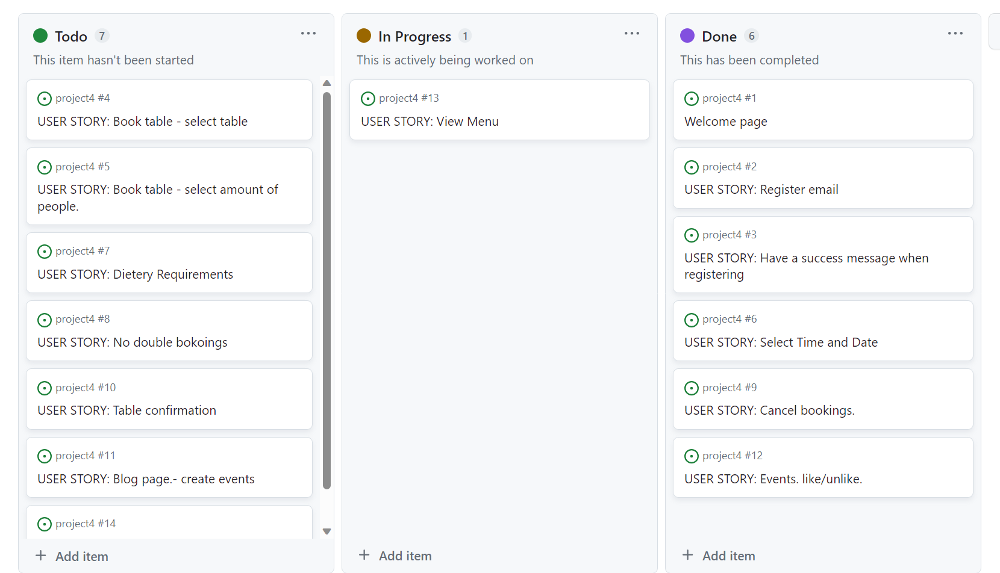 
Projects can be created from the tabs menu. Along side Issues which can be attached the the repositories Project. 

 

## Agile

The Agile Tool used to develop this project was on Github's Project Board. A Project can be added to a repository, and then Issues can be built up from here to make a todo list, in progress list or done list. These Issues can carry 'User Stories', to create separate categories such as importment, could do, done or not done. User Stories can be broken down into many more catergories. Templates for Issues can be edited and created to suit certain needs, such as 'User Stories' for this project. 

Filled in Template for Issues. 
 

Issues can be added to todo list, in progress list or done list. They can also be added to a Repository(Project 4). 
 

Labels can be created or use default labels to organise the Issues relating to the Project Board. 
 
 

## Colours

Colour Scheme for the website is based on a very tasty cocktail - Amaretto Sour. With light and deep orangey colours, an egg white topping and a red cherry on top. 
Black is always got for an outline or to ensure writing stands out. 
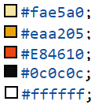 

## Typography

The fonts were used from [Google Fonts](https://fonts.google.com/) and are install by  link in the Head of the page. 
Bebas Neue - I like the large capital block type use of this font with contrast well with the funky more 'fruity' floaty font type of the Yellowtail.  
Oswald - This was a good business standard text to use and very readable, like the Bebas Neue. 
Yellowtail - This 'fruitier' messy style i thought, suited a Cocktail Bar style, for the text. 
 

## Icons

Icons are created by [Font Awesome](https://fontawesome.com/) and used in this project. They are used to portait social links, a pulsing 'Heart' icon on the Bookings page and a different 'Heart' icon again for the like status. Also, a speech bubble is used for the 'Total number of comments' icon.

 

[Back to the top](#cocktail-bar)

# Admin Experience.

Django was used to create an Administraion panel Interface that has information from both the 'Bookings' App and 'Forum' App, directed to it for staff and management to receive and manipulate. See [Other Installed Libaries](#other-installed-libaries) for more information on creating and starting new projects and applications with Django.
 
The installed applications should be added to **INSTALLED_APPS in settings.py**. See example below. 

 

 

In Beanfeast project, within the directory, a url path has to be added to `url.py` and imported from Django: 
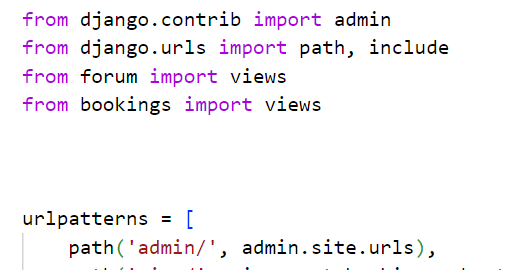 

Verify that Admin has be installed but migrating additions. See [migrations](#migrations) for more details on migrating. 

Create a **superuser** to use the administraion page. Not avaliable to just anybody! 

CLI input **python3 manage.py createsuperuser**. 
Follow the instructions to enter: 
USERNAME: 
EMAIL:(NOT NEEDED) 
PASSWORD: 
 
Login panel, if it is working looks like the below image: 

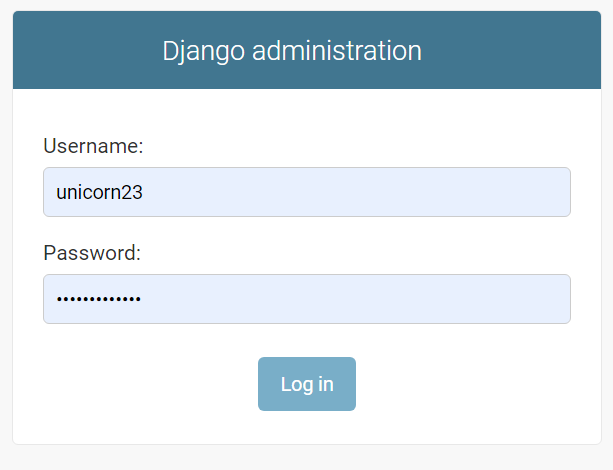 

The models being used now need to be registered with the Admin panel. 
Register is and connect it to a class, inside the `admin.py` file for the App. 
Make sure django.contrib imports admin. 
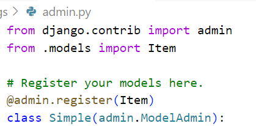 

View in Django Admin once registered, below. 
BOOKINGS = Application name. 
Items = Model for booking items. 
 

Or simpley register it, inside the `admin.py` file for the App. 
 

Once the models are registered, they can be accessed via Django Admin. 

To access the admin site the following context should be used: 
`http://your-server-ip:8000/admin` 
The `username` created for the purpose of this website is:
The `password` created for the purpose of this website is:

Tha administraion page offers features such as:
<ul>
<li>View forum in draft or published stage.</li>
<li>View bookings or forum posts by whether they have been approved or not. 

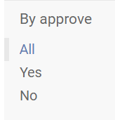</li>

<li>Add Forum posts and Forum comments from Admin.</li>
<li>Approve or delete a booking.

</li>

<li>Approve or delete comments.</li>
<li>Events/News that have been created in Forum can be removed. They are viewed one per page. 
Improves user focus on one Forum post.</li>
</ul>

## MVC framework.

The **MVC framework** needs to be followed to ensure models can be used, viewed and controlled. 

A 'model' is created within a class, in `models.py`. 
The 'model' is to create the ability to check reservations and approve them. 
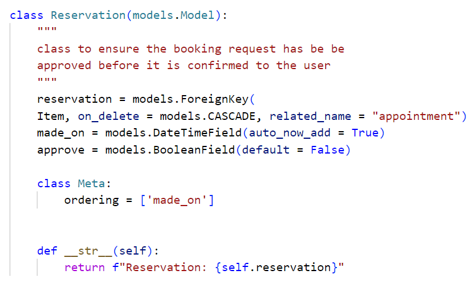 

That model is placed into a class to create a 'view', in `views.py`. 
It gets all the objects from the reservation 'model', applys any requirements and sets a request for rendering HTML to a 'view'. 
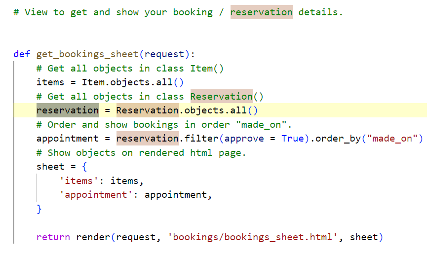 

When the 'view' is modelled, it creates a 'controller' accessible feature to update the model, as in this example. 
The staff or management can receive the booking and approve or delete it. 
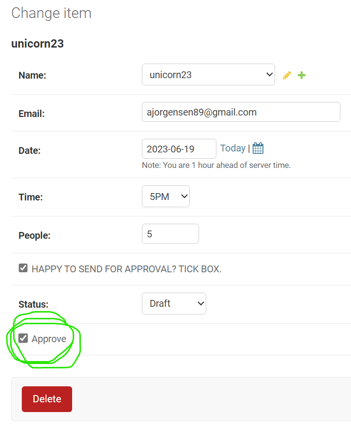 
 

# Features.

This projects **Features**, for a potentail cocktail bar called **Beanfeast** includes:
**Navigation Bar** - Contains Logo, a little excerpt and navigation links. 
 
**Welcome page** - Welcome to Beanfeast message and link to Forum's and upcoming Events and News. 
**Bookings page** - For Booking Form view. 
**Register and Login Page** - User can login in or register in not done so already. 
**Log Out Page** - Once logged in, a 'Sign out' page will be avaliable. 
**View Bookings page** - on 'VIEW NOW' page. 
**Booking Form** - send a booking request to Admin for approval via a form requesting, name, email, date, time, number of people and a radio button to tick for 'HAPPY TO AWAIT APPROVAL'. 
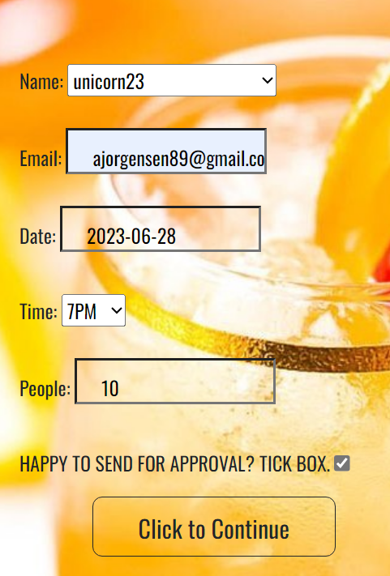 
**Date** - Select a date in the format YYYY-MM-DD. 
**Time** - Select a time in the format HH-MM-SS. 
**Create a booking.** - once created the user has to wait for approval from 'admin' before they are viewed and confirmed. This could potentailly help with tables or times being double booked if the 'admin' can confirm it as an avaliable booking slot. 
**View bookings.** - once approved. The user will be able to view their bookings, once logged in, from the website on the 'VIEW NOW' page. They will be able to edit and cancel bookings from here. All forms have a background-image of a cocktail. 

**No Bookings** - No Bookings. 
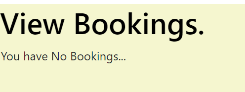

**Edit current bookings.** - The user can edit their bookings and again, have to wait for approval for the booking to be viewed and accepted by 'admin' side. 
**Cancel or Delete a booking.** - Bookings can be fully removed. It a user cancels a booking, the booking will be removed from the 'admin' side also. 
**Register** - The user need to register to the site before being able make a booking. 

**Forum Post for Events** - Administraion can post events occuring at the Cocktail Bar. User's registered to the website will be able to comment on these Events. Unregistered user's to the website will be able to see the 'Event' information of the Forum but not be able to comment. 
**Forum Comments for Event** - Regitered User's will be able to comment on Event posting's. They will be viewed on the website if Administraion has approved it. This offers a discussion board for user's of the website. 
**Delete Comments** - A user can delete a comment they have posted if they are signed in. 

If user is not signed in, comments can not be deleted. 

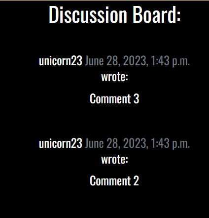

If user is signed in, comments can be deleted. 

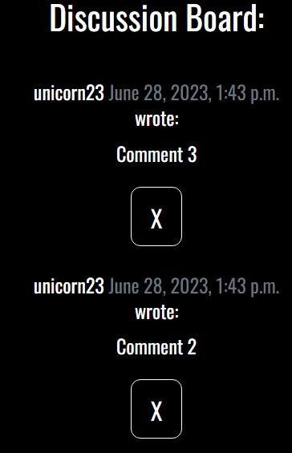

User needs to be authenticated via [Jinja](https://jinja.palletsprojects.com) IF statment 

**Likes** - 'Likes' can be clicked and are represented as a 'heart icon' for people, again, who are registered can 'like' a comment or Event posting. A user can choose to 'unlike' a post too by re-clicking the 'heart icon'. 

**Images** - Different images can be displayed for each different Forum Post created. An image is also displayed in the forms background. 
**Footer** - Has social links, opening times and days, a fictioncal contact number and address. 
 

**Alert Banners** - As the user interacts with the webpage, such as registering, creating a booking, editing a booking or cancelling one, 'Alert Banners' through 'Message Tags in Django' are created as prompts.
 

**JavaScript** - Used to set time out for alert banners. Created with Code Institute walkthrough projects.

Input into settings.py
 

These had to be written into settings.py and have a for loop created for them to loop 'message' and then the 'tag'. Such as 'message.success'. 
**Csrf Token** - Included in forms for protection of user information in form submissions. 
 

Input into HTML in [Jinja](https://jinja.palletsprojects.com) For Loop. 
 

[Back to the top](#cocktail-bar) 

# Deployment

To deploy this Full Stack project, [Heroku](https://dashboard.heroku.com/), a cloud based platform was used.
Follow the steps for deployment method: 
1. If needed, sign in and register to Heroku website first. _Click_ on **New** in the top right corner to create a new application.  
 

2. Add an application name. Follow the rules of what you can enter. Select a region, and _click_ **Create App**. 
 
3. Next stage will be a few changes on this page below. First, click into **Settings**.
 
4. Once in **Settings**, Config Vars need altering. Remove <em>DISABLE_COLLECTSTAIC</em> on deployment. 

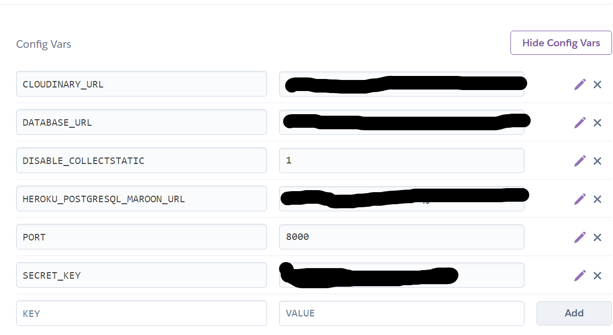 
5. Now _click_ into **Deploy**. This wesbite was connected to **Github**. Which can be selected at the top. The **orange line**, shows the location to connect your repository from **Github** to **Heroku**. _Enter_ the name of the repository you need and connect. This pictures shows the repository already connected via **Github**. _Scroll_ to the bottom of the page to deploy. Select **main branch** and _click_ **Deploy Branch**. 
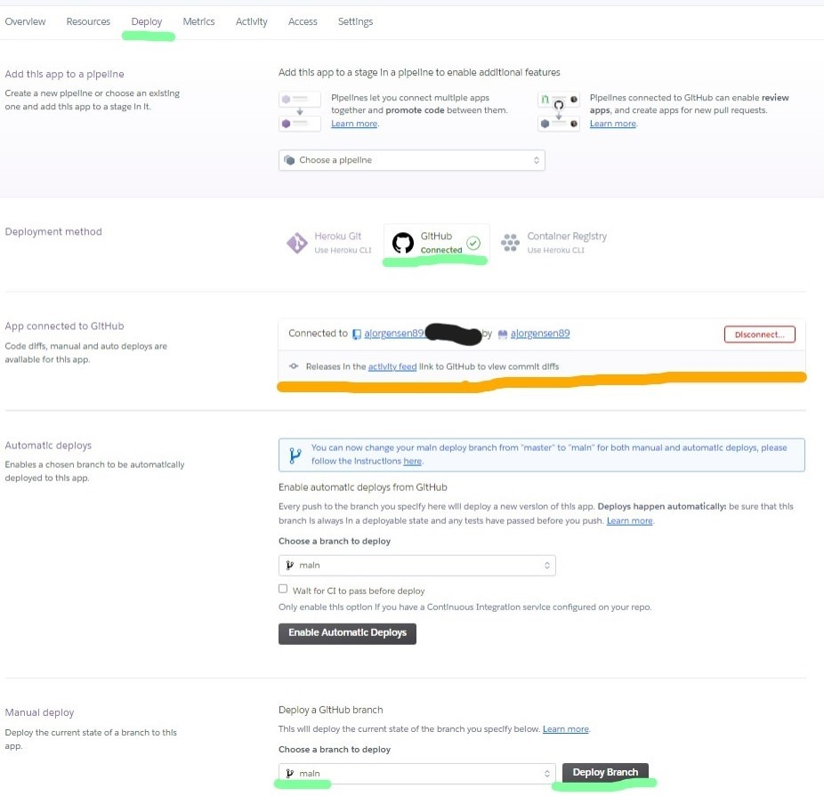 
6. The website may show as _building_ for a while. Once it has completed, it should look like the images below, with a **view** link. _Click_ here to view your website. 
 

[Back to the top](#cocktail-bar)

## Clone website.

To clone the project. I _clicked_ **code** in the respository file. In the dropdown menu, **copy** the link. 
Here, on the image below,  the locations are highlighted in **pink**. 
 
Once cloned, **open** an IDE such as **GitBash**, to clone your wesbite. _Type_ **git clone** followed by your copied **URL link**. Hit enter.
 

[Back to the top](#cocktail-bar) 

# Technologies Used.

This content includes the variety of Technologies used in creating this website to make it function and to improve the development, aesthetics, functionality and compatability. 
 

# Installing Django.

## Django

This project has implemented [Django](https://www.djangoproject.com/), a [Python](https://www.python.org/) web framework. [Django](https://www.djangoproject.com/) has been used it different ways to help build this site. 

[Django](https://www.djangoproject.com/) frameworks and API's used are as followed:
[Messages Tags.](https://django.readthedocs.io/en/stable/ref/contrib/messages.html)  to create Alert banners for particular user actions. 
[Administration](https://docs.djangoproject.com/en/4.2/ref/contrib/admin/) for Admin Interface Model. 
[Testing](https://docs.djangoproject.com/en/4.2/topics/testing/) built in while building website when creating a [Django](https://www.djangoproject.com/) Project. 
[Allauth](https://django-allauth.readthedocs.io/en/latest/) was used as a Django application to created authentication, account management and registration. 

## Font Awesome

[Font Awesome](https://fontawesome.com) Used for font text. Used direct through the [Font Awesome](https://fontawesome.com) website or via a [Bootstrap CDN](https://www.bootstrapcdn.com/) link. 

## Bootstrap

[Bootstrap](https://getbootstrap.com/) was downloaded into the coding workspace by a [Bootstrap CDN](https://www.bootstrapcdn.com/) to be used throughout the website for inbuilt solutions and methods for helping the layout and design of this website including, style, colour, formatting and poistioning. 
Here are a few links to different areas of the Bootstrap wesbite that was used within this website. 
Here's some examples of Bootstrap that were used: 
[CSS grid](https://getbootstrap.com/docs/4.0/layout/grid/) with [Bootstrap](https://getbootstrap.com/) 
[CSS colours](https://getbootstrap.com/docs/4.0/utilities/colors/) with [Bootstrap](https://getbootstrap.com/) 
[CSS colouring](https://www.bitdegree.org/learn/bootstrap-colors) 
[Bootstrap Icons](https://www.bootstrapcdn.com/bootstrapicons/) 
[Bootstrap Cards](https://getbootstrap.com/docs/4.0/components/card/) 
[Bootstrap Buttons](https://getbootstrap.com/docs/4.0/components/buttons) 
[Bootstrap CSS](https://getbootstrap.com/docs/4.1/layout/grid/) 
 

## Crispy Forms

[Django Crispy Form Template](https://pypi.org/project/django-crispy-forms/) used to render HTML. 

## Summernote

[Summernote](https://summernote.org/getting-started/) has been imbedded into [Django](https://www.djangoproject.com/) to improve the layout for administraion input. 
 

## Python Tutor.

[Python PEP8 checker](https://www.pythonchecker.com/). Helps to test, run and visualize parts of code to pass PEP8 requirements. 
 

## Heroku.

[Heroku](https://dashboard.heroku.com/) is a cloud based platform used to deploy the application on. 
 

## Github.

[Github](https://github.com/) was used to edit and build the website using  code. 

 

[Back to the top](#cocktail-bar)

 

# Other Installed Libaries.

## Requirements.txt file.

A file was created within the project to hold all the necessary input for these installed libaries to function - **requirements.txt**. 
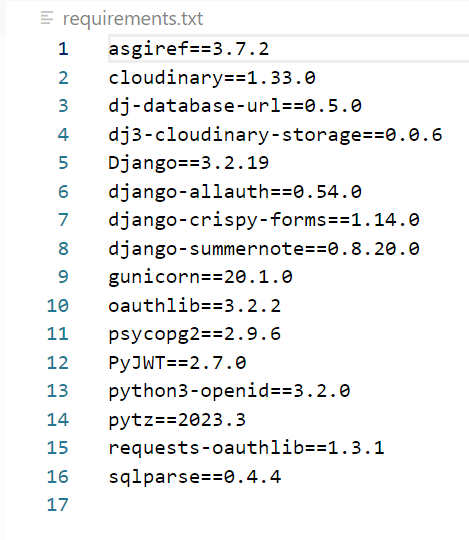 

### SERVER GUNICORN

To run [Django](https://www.djangoproject.com/) on, for [Heroku](https://dashboard.heroku.com/) devlopment.

CLI input - **pip3 install 'django<4' gunicorn**. 

### POSTGRESQL LIBARY - ELEPHANTSQL.

[ElephantSql](https://www.elephantsql.com/) hosted the Database for storing data to be used within a cloud.

CLI input - pip3 install dj_database_url==0.5.0 psycopg2. 

### CLOUDINARY CLOUD STORAGE.

This was used to store images for use within the project. Other files can be hosted here too. 

CLI input - **pip3 install dj3-cloudinary-storage**. 

### REQUIRED FILE.

Redirect to requirement.txt to store the files when installation is successfull.

CLI input - **pip3 freeze --local > requirements.txt**. 

### NEW DJANGO PROJECT.

Creates new manage.py file and a directory called 'beanfeast'. 

CLI input - **django-admin startproject beanfeast .** (dot(.) = create project in current directory) 

### CREATE FORUM AND BOOKINGS APP (NEW APP).

Creates a new application within the project with separate files for manpulating.

CLI input - **python3 manage.py startapp forum** (add to settings.py file. INSTALLED_APPS). 
CLI input - **python3 manage.py startapp bookings** (add to settings.py file. INSTALLED_APPS). 

### DJNAGO SUMMERNOTE.

[Summernote](https://summernote.org/getting-started/) uses the Open Source libraries jQuery and Bootstrap.

CLI input - **pip install django-summernote**
 

### DJANGO CRISPY FORMS.

[Django Crispy Form Template](https://pypi.org/project/django-crispy-forms/) is used to build reusable layouts out of components, can editor HTML without the HTML content in the template. 

CLI input - **pip install django-crispy-forms**
 

## Django Alluth

[Django Allauth](https://django-allauth.readthedocs.io/en/latest/index.html) is used to create pages to register on, sign in and sign out and help support authernication flow on the website. 

CLI input - **pip3 install django-allauth**
 

### MIGRATE CHANGES

To migrate to the Database for each new App or change to App. 

CLI input - **python3 manage.py migrate**  

### RUN SERVER 

CLI input -- **python3 manage.py runserver** 
(IF URL NOT ALLOWED - ADD URL TO ALLOWED_HOSTS in settings.py). 

### NON-COMMITED FILE

A file called **env.py** should be created to hold environments for safely developing new websites. 
It should be entered into the .gitignore file to avoid being commited. 
This does involve saving a snippet of it incase the coding environment is closed and returned to at a later date, and a new environment is created. **The env.py is not saved**. 

import os 
 
os.environ["DATABASE_URL"]="postgres-URL-here" 
os.environ["SECRET_KEY"]="ooh-super-secret" 
os.environ["CLOUDINARY_URL"] ="cloudinary-URL-here" 
 

[Back to the top](#cocktail-bar)

 

## Migrations.

As models are created they have to be migrated to the Database. New models or even edited or changed models. 
CLI input: 

#### Check which migrations are to be made.

**python3 manage.py makemigrations --dry-run**   

#### To make the migrations shown.

**python3 manage.py makemigrations** 

#### To show any migrations that need to be done in a list, for indentification.

**python3 manage.py showmigrations** 

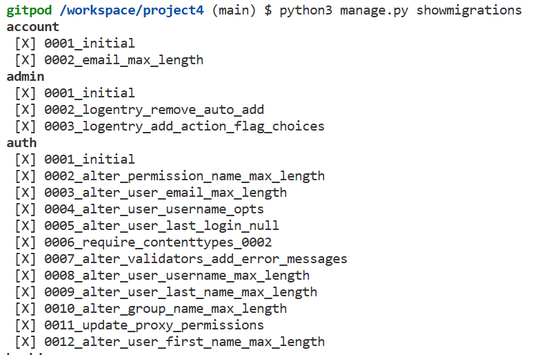 

#### To complete the migration.

**python3 manage.py migrate** 

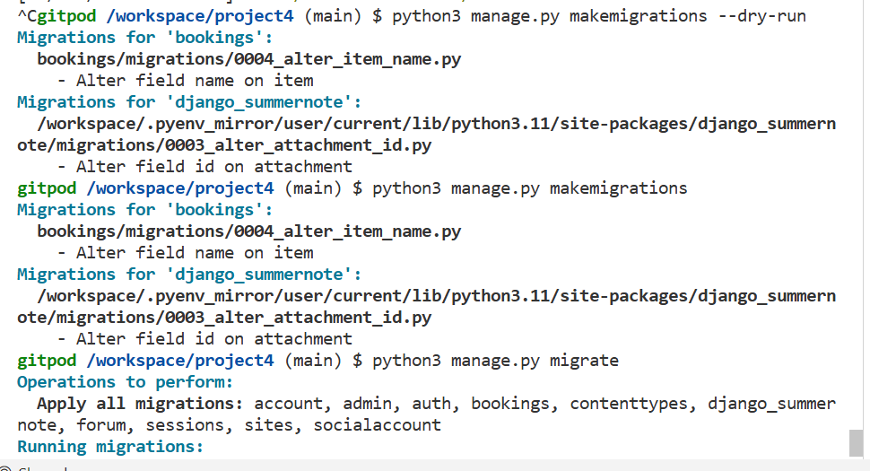 

[Back to the top](#cocktail-bar)

 

## Jinja.

[Jinja](https://jinja.palletsprojects.com) Python template engine was used within this project in input blocks of code. IF/ELSE statements can also be created depending on what template or [HTML](https://en.wikipedia.org/wiki/HTML) needs rendering to the view. 
Example of **Block content** in jinja templating highlighted in **yellow box** 
Example of **If/Else** in jinja templating highlighted in **purple box** 
Example of **For loop** in jinja templating highlighted in **green box**. 
Example of **empty** in jinja templating highlighted in **brown box**. This show HTML is nothing is rendered to the page. 

 

[Back to the top](#cocktail-bar)

 

# Browser combatability.

Checked the websites combatability with the following browers:
1. Apple Safari.
2. Google Chrome.
3. Opera Browser.
4. Microsoft Edge. 

Ran the website with no significant issues. 

See [Testing](testing.md) file for full use of technologies used to test this wesbite. 

[Back to the top](#cocktail-bar)

# Future Features and business logic.

This project could benefit from a number of diffferent features in the future. Due to time and skill constraints, some could not be implemented. Some future features are just fresh ideas that the website could benefit from in a real world situation. 
 
Confirmation of booking with the cocktail bar, rather then having to log in to check if it has been approved from the website 'VIEW NOW' page. 
 
When a booking is 'rejected', the user view for the user will display the **You have no bookings with us yet...** message. This could be confirmed better, even via email. 
 
Implementing a choice of date, by supplying a widget or different input format, possibly from Django.forms.Form. 
Bookings could be displayed in sections to show the user awaiting approval, approved and not approved status. 
 
In a real world situation, a Cocktail Bar would have a limited number of tables each hour, on each day. This could be greatly improved so Admin would not have to reject so many booking requests, as they probably would with this website. 
 
For this project, tables fit a max of 10 people with no minimum. Anybody welcome! 
This could mean sitting 5 groups of 2 at a table of 10 to fill up the cocktail bar. 
Hoping for adaptable users! 
In the future different table sizes could be created to suit different groups of people. 
Over booking and double booking tables would be important to avoid. The Admin or management for this project can just reject the bookings, but in the future a better approach can be developed. 
 

I would have liked to offer the users a separate Gallery and Menu pages so they could see the Cocktails avaliable and see what Beanfeast the Cocktail Bar itself looked like before arriving. This would have greatly increase User Experience to this site. 
 
The Agile Tool, for this instance, was Github Project Boards, can label Issues and User Stories that have not been completed and would offer a good starting ground for future development and features for this project, Beanfeast site. 

Template of Not Done labelled Issue. 

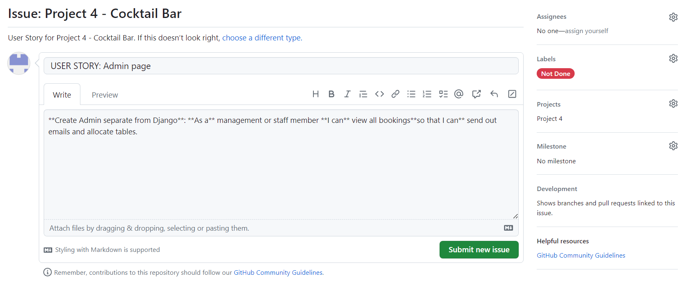 

'Not Done' labelled items can be filtered out on the Project Board. 

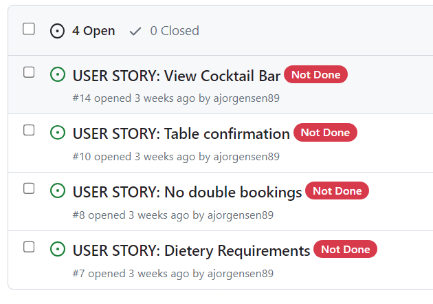 

 

[Back to the top](#cocktail-bar)

# Credits.

1. [Code Institute](https://codeinstitute.net/) for providing examples of [Django](https://www.djangoproject.com/) projects through [Code Institute](https://codeinstitute.net/) Coursework to grasp the concept of building projects using databases, multiple libaries, API's, frameworks, Bootstrap, Django and Django Built-in benefits such as testing. This helped when creating my 'Booking App' and 'Forum' App and applying migrations to database of installed items. It also helped with the use of [Bootstrap CSS](https://getbootstrap.com/docs/4.1/layout/grid/) use.  
It also helped with the creation of 'Message Tags'. 

2. [Stack Overflow](https://stackoverflow.com/questions/12615154/how-to-get-the-currently-logged-in-users-user-id-in-django). for help with authenticating user using [Django](https://www.djangoproject.com/) methods. 

3. [Django Documents](https://docs.djangoproject.com/en/4.2/topics/testing/overview/) for testing using TestCase.

4. [Django Documents](https://docs.djangoproject.com/en/4.2/topics/testing/advanced/) Testing tips and hints.
 

5. [Python Testing Documents](https://docs.python.org/3/library/unittest.html#unittest.TestCase.assertEqual) for testing tips.

6. [Bloomreach](https://documentation.bloomreach.com/engagement/docs/jinja-syntax) for checking Jinja methods.

[Back to the top](#cocktail-bar)

# Awknowledgements.
To the **Tutor Support** team for [Code Institute](https://codeinstitute.net/) for continued support and assitance. 
To mentor **Precious Ijege** for continued support and patience while taking part in the course provided by [Code Institute](https://codeinstitute.net/) for a Diploma in Full Stack Software Development. 
To the Walkthrough projects of both <em>'Hello Django'</em> and <em>'I think therefore I blog'</em> mini projects supplied by [Code Institute](https://codeinstitute.net/) Coursework. 

[Back to the top](#cocktail-bar)

